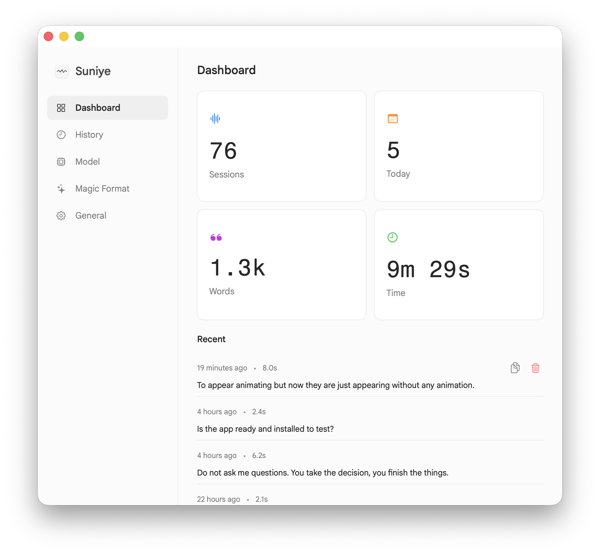

<div align="center">


<h1>Suniye</h1>

<p><strong>Private dictation for macOS. Hold a key, speak, and your words appear&nbsp;— right where your cursor is.</strong></p>

<p>Speech recognition runs entirely on your Mac. No cloud, no account, no audio ever leaves your machine.<br/>
<em>(Suniye is Hindi for “listen.”)</em></p>

<p>
  <a href="https://suniye.kishans.in"><strong>Website</strong></a> ·
  <a href="https://github.com/kishanhitk/suniye/releases/latest"><strong>Download</strong></a> ·
  <a href="#reporting-a-problem"><strong>Report a bug</strong></a>
</p>

<p>
  <a href="LICENSE"></a>
  
  
</p>



</div>

> **Alpha** — expect rough edges and breaking changes while Suniye finds its feet.

## Talk instead of type

Typing is a bottleneck. Suniye turns the fastest thing you do — talking — into text in any app, without sending a single word to the cloud.

Hold your hotkey, say what you mean, release. Your words land at the cursor in Mail, Slack, your editor, a terminal — anywhere you can type.

- **Private by default.** Local speech models transcribe on-device. Your audio never touches a network, so there's nothing to store, leak, or train on.
- **Instant.** No round-trip to a server. The model is always loaded, so speech becomes text in milliseconds, not seconds.
- **Everywhere you type.** Text is inserted through the macOS Accessibility APIs, so it works in every app — not just a special editor.
- **One shortcut.** Hold Fn/Globe (or any combo you pick), talk, release. No modes, no buttons.
- **Yours to inspect.** Open source under the MIT license — read every line, build it yourself, or send a patch.

## How it works

1. A small icon lives in your **menu bar** — that's Suniye, listening for its hotkey.
2. **Hold your hotkey** (default: Fn/Globe) and speak naturally.
3. **Release** — your speech is transcribed on-device and pasted at the cursor.

## Install

Requires **macOS 14 (Sonoma)** or later.

### Homebrew (recommended)

```bash
brew install --cask kishanhitk/tap/suniye
```

This taps [`kishanhitk/homebrew-tap`](https://github.com/kishanhitk/homebrew-tap) and installs the latest release. Suniye is self-signed (not yet notarized), so the cask clears the Gatekeeper quarantine for you — no manual steps. Update with `brew upgrade --cask suniye`, though Suniye also updates itself in the background.

> On Homebrew 6+ you may be asked to trust the tap on first install — third-party taps run code (here, a postflight that clears quarantine), so Homebrew gates them behind trust. The fully-qualified command above trusts just this cask.

### Direct download

1. Grab **Suniye.dmg** from the [latest release](https://github.com/kishanhitk/suniye/releases/latest).
2. Open it and drag **Suniye.app** into `/Applications`.
3. If macOS blocks it on first launch, clear the quarantine and reopen:
   ```bash
   xattr -dr com.apple.quarantine /Applications/Suniye.app
   ```

### First launch

Suniye asks for two permissions — **Microphone** (to hear you) and **Accessibility** (to type into other apps) — then walks you through a short setup and a practice dictation. It installs a recommended speech model (**Parakeet TDT 0.6B v3**) in the background while you try it out.

See [docs/INSTALL.md](docs/INSTALL.md) for checksum verification and detailed steps.

## What's inside

| | |
|---|---|
| **Dashboard** | Sessions, words dictated, total time, and recent activity — at a glance |
| **History** | Searchable log of past transcriptions; copy or delete any entry |
| **Magic Format** | Optional AI cleanup for punctuation, capitalization, and formatting |
| **Edit Mode** | Select text anywhere, hold a second shortcut, and speak an instruction (“make this formal”) to rewrite it in place |
| **Live preview** | Watch a partial transcript appear in the floating indicator as you speak |
| **Models** | Compare, install, and switch local speech models by speed, quality, size, and language |
| **Vocabulary** | Teach Suniye your names and jargon so it gets them right |
| **Your hotkey** | Any hold-to-talk shortcut you like — Fn/Globe, modifier combos, and more |

### Magic Format — cleanup that can stay on your Mac

Turn a raw transcript into polished text on your terms. It's off until you turn it on; when enabled, it cascades and stays local wherever it can:

1. **Apple Intelligence** — on supported Macs, nothing leaves the machine.
2. **A local model** — a small on-device formatter (Gemma) that works fully offline.
3. **Your own provider** — bring an OpenAI-compatible key; only text (never audio) is sent, and only if you choose this.

## Choose your speech model

Suniye ships a curated catalog instead of a single fixed recognizer — pick the trade-off you want between speed, accuracy, size, and languages. Everything runs offline, and you can switch instantly from the **Model** page.

| Model | Best for |
|---|---|
| **Parakeet TDT 0.6B v3** | Recommended default — 25 European languages |
| **Parakeet TDT 0.6B v2** | Strong English-focused option |
| **SenseVoice** | Chinese, Japanese, Korean, English, Cantonese |
| **Moonshine Base** | Fastest lightweight English |
| **Whisper Large v3 Turbo · Distil · v3** | Broad multilingual coverage |
| **Whisper Tiny · Base · Small (English)** | Small, fast English downloads |

## Privacy

- Transcription happens **entirely on your Mac**. Audio is processed in memory and never sent anywhere.
- The only network calls are model downloads, update checks, optional pseudonymous usage stats (counts and timings — never your words, and opt-out in Settings), and issue reports you explicitly submit.
- With Magic Format's on-device options, cleanup stays local too. Only the optional API provider sends text (never audio) off your Mac — and it's off by default.

---

## Under the hood

Suniye is a native macOS app. The technical bits, for the curious and for contributors:

| | |
|---|---|
| **Platform** | macOS 14+ (Apple Silicon and Intel) |
| **UI** | SwiftUI |
| **Speech engine** | [sherpa-onnx](https://github.com/k2-fsa/sherpa-onnx) with a curated local model catalog (Parakeet, Moonshine, SenseVoice, and Whisper variants) |
| **Text insertion** | macOS Accessibility APIs |
| **Updates** | [Sparkle](https://sparkle-project.org) — Stable and Tip channels |
| **License** | [MIT](LICENSE) |

### Build from source

```bash
# Prerequisites: Xcode, XcodeGen (brew install xcodegen)
./scripts/setup_sherpa.sh
./scripts/setup_model.sh
./scripts/doctor.sh          # verify environment
./scripts/build_app.sh Release --output-dir ./dist
open ./dist/Suniye.app
```

For side-by-side local development, build the preview variant instead:

```bash
./scripts/build_app.sh Debug --preview --install-user --open
```

This installs `~/Applications/Suniye Preview.app` (bundle id `dev.suniye.app.preview`) so it can coexist with the release build. The preview variant disables Sparkle updates and shares the local ASR model cache under `~/Library/Application Support/Suniye/models`.

Run the tests:

```bash
./scripts/e2e_preflight.sh && ./scripts/e2e_smoke.sh
```

### Update channels

Suniye checks for updates in the background; **Stable** is the default. To ride the latest `main` build, open **General** settings and switch **Update Channel** to **Tip**. Switching back to Stable won't downgrade you — Sparkle waits for a stable build newer than your installed tip.

### Reporting a problem

Use **Report a Problem** from the menu bar, the General page, or the Help menu. Suniye sends your description and an optional, sanitized diagnostics bundle to the maintainer's private queue. Diagnostics are logs and metadata only — audio, transcripts, clipboard contents, API keys, and model files are never included.

## Contributing

Contributions are welcome. See [CONTRIBUTING.md](CONTRIBUTING.md) to get started, and browse [releases](https://github.com/kishanhitk/suniye/releases) for what's changed.

<details>
<summary><strong>Maintainer note — Sparkle signing key recovery</strong></summary>

<br/>

GitHub Actions secrets are write-only; `SPARKLE_PRIVATE_KEY` can't be read back after it's stored. The owner copy lives in the local macOS Keychain under Sparkle account `suniye`. To export it from a Sparkle distribution:

```bash
./bin/generate_keys --account suniye -x ./suniye-sparkle-private-key
```

Keep the export in a password manager or other secret store, then delete the local copy.

</details>

---

<div align="center">
<sub><strong>Suniye</strong> · MIT License · <a href="https://suniye.kishans.in">suniye.kishans.in</a></sub>
</div>
