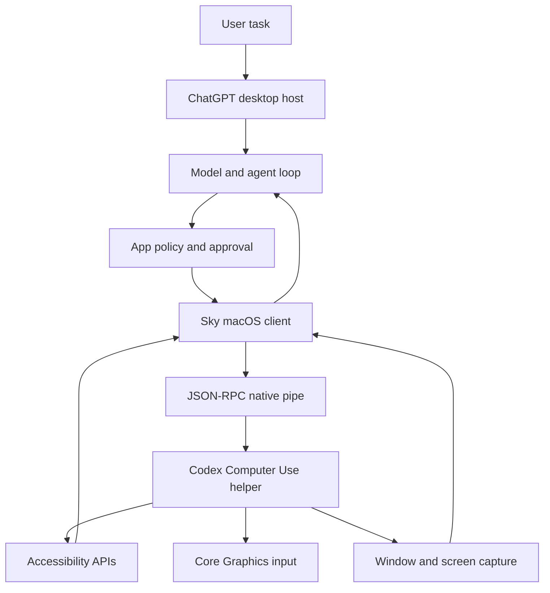
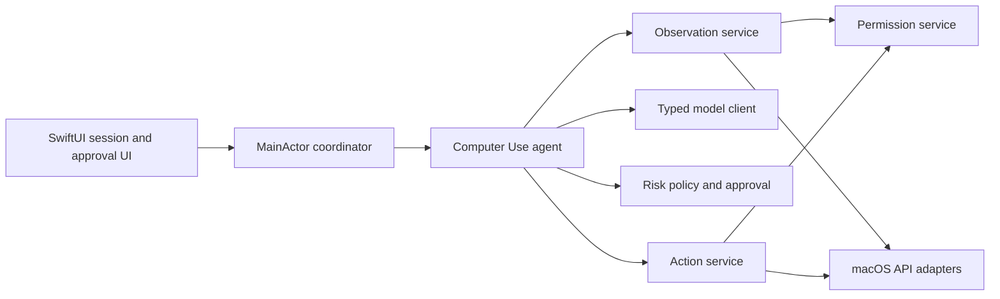

# KIS-169 Computer Use architecture notes

Status: research complete. The evidence ledger is the source of truth for claim status.

## Executive summary

The DMG contains three useful layers.

1. A ChatGPT desktop host owns the user interface and host services.
2. The Sky package exposes model-facing computer actions.
3. A native Computer Use helper performs macOS desktop work.

The public macOS Sky target is app based. It returns accessibility text and a screenshot. It then accepts one action at a time.

The observed design is not a single model call. It is a state and action loop.

The exact model and server loop remain unknown.

## Observed component map

Status: `[Inferred]` for the end-to-end flow. The component names and protocols are `[Verified]` in the ledger.

## Model, state, and action loop

### Model boundary

- `[Verified]` The Sky README calls the API model-facing.
- `[Verified]` Sky accepts a structured app target and returns structured state or action results.
- `[Unknown]` The DMG does not show the exact model name, prompt, token format, or remote request endpoint.

The model should not call macOS APIs directly.

The model should see a bounded observation.

The host should validate every model action before execution.

### State

The public macOS state contains:

- the targeted app identifier;
- a screenshot data URL or null;
- accessibility text from the target window.

The text can contain app-specific guidance on first access.

Element indices belong to the latest state.

The model must not reuse an old index after the UI changes.

### Loop

The observed and inferred loop is:

1. Resolve the target app.
2. Check the app policy.
3. Ask for user approval when the policy requires it.
4. Capture accessibility text and a screenshot.
5. Send the observation and task to the model.
6. Validate one model action.
7. Check approval and safety rules for that action.
8. Execute the action through Sky and the native helper.
9. Capture fresh state.
10. Repeat until the model finishes, the user stops, or the system fails.

Steps 1, 2, 4, 6, 8, and the returned data shape are `[Verified]` or directly represented by the artifact.

The complete model loop is `[Inferred]` because the server-side model orchestration is not in the DMG.

## App and window discovery

### Public app discovery

`list_apps()` returns:

- a canonical app identifier;
- a display name when available;
- whether the app appears to run;
- a last-used timestamp when available;
- a usage count when available.

`get_app_state()` accepts an app identifier.

The public macOS API does not expose a separate stable window object.

The Windows window API does expose an explicit window object. This is a real platform difference.

The Sky wrapper accepts app IDs, display names, process names, and other supported identifiers. The exact native resolution rules remain unknown.

### Native discovery

The helper binary contains `CGWindow`, window tracking, frontmost-window, and Accessibility names.

This proves that the helper has native window and accessibility components.

It does not prove the exact selection order.

The selection algorithm is therefore `[Unknown]`.

## Accessibility and screenshot handling

### Accessibility

The helper binary contains `AXUIElement` and Accessibility names.

The state protocol returns accessibility text, not a raw AX object graph.

The public action API uses element indices from that text.

The native helper must therefore flatten native accessibility data into a model-readable representation.

The exact flattening format is `[Unknown]` beyond the public text field and index contract.

### Screenshots

The public state returns a data URL.

The capture bridge also returns a local screenshot URL and MIME type.

The worker validates image paths and allows PNG, JPEG, and JPG output.

The worker rejects images larger than 25 MB.

The helper links ScreenCaptureKit and CoreGraphics.

The exact choice between ScreenCaptureKit and CoreGraphics for each capture is `[Unknown]`.

## Supported macOS actions

| Action | Public input | Evidence status |
| --- | --- | --- |
| `click` | Element index or app-window coordinates, button, click count | `[Verified]` |
| `drag` | Start and end app-window coordinates | `[Verified]` |
| `press_key` | One key or a `+` key chord | `[Verified]` |
| `scroll` | Direction, pages, and element index | `[Verified]` |
| `type_text` | Text and app target | `[Verified]` |
| `set_value` | Element index and replacement value | `[Verified]` |
| `select_text` | Element index, text, context, and selection mode | `[Verified]` |
| `perform_secondary_action` | Element index and accessibility action name | `[Verified]` |

The action wrappers pass requests through the same app policy gate.

The exact native event synthesis for each action is `[Unknown]`.

## Permissions

The helper reports a permission grant state.

The observed states include:

- no permission granted;
- Accessibility granted;
- Screen Recording granted;
- both permissions granted.

The helper also reports pending and abandoned permission flows.

The helper binary contains named Accessibility and Screen Recording permission types.

The helper links ApplicationServices, CoreGraphics, ScreenCaptureKit, and AppKit.

The exact TCC calls and prompt sequence remain `[Unknown]`.

## Approval and safety

The Sky policy has two layers.

First, the app policy can allow, deny, or forbid use.

Second, the host can ask the user for approval.

The approval request names the app.

The approval metadata identifies the Computer Use connector and the app bundle identifier.

The visible persistence choices include session and always.

The observed approval bridge supports accept, decline, and cancel.

The bridge times out after five minutes.

It rejects pending requests when its transport closes.

The artifact also contains settings for allowed apps, click sounds, and use while the Mac is locked.

The artifact contains app-specific safety instructions.

For example, the Slack instructions warn that Return can send a message. The Clock instructions require a current timer state before starting a new timer.

These examples show that safety needs context. A blanket click permission is not enough.

The full production safety policy is `[Unknown]` from this DMG alone.

## Native helper responsibilities

### Verified responsibilities

The helper is a signed arm64 app.

It has a dedicated bundle identifier and application group.

It links the main macOS frameworks needed for Accessibility, input, capture, windows, and XPC.

Its binary contains JSON-RPC socket, XPC, permission, window, AX, CGEvent, and ScreenCaptureKit names.

### Inferred responsibilities

The helper likely performs these operations:

- resolve an app and its key window;
- read the AX tree;
- flatten AX data into text with indices;
- capture a bounded window image;
- synthesize mouse and keyboard input;
- perform AX semantic actions;
- report permission state and native errors;
- keep a session identity for requests.

The exact implementation remains unknown because the helper is a compiled binary.

## Process communication

### Sky to native helper

The macOS Sky client uses a Unix socket in the helper application group.

The client sends JSON-RPC messages.

The transport uses a four-byte little-endian frame length.

The client pings the server and checks the API version.

The client starts the helper through a host launch-services bridge when the socket is unavailable.

### ChatGPT worker to native helper

The readable worker uses Apple Events for appshot capture.

It resolves the helper process identifier.

It sends JSON request data in an Apple Event.

It receives typed capture updates.

The worker retries selected Apple Event transport failures.

### Boundaries that remain unknown

The DMG does not show the full model-to-Sky call path.

The DMG does not show whether one process or several processes own the complete agent session.

The DMG does not show an explicit macOS cancellation message for every action.

## Error, cancellation, and user intervention

### Verified error paths

The error table includes permission, app lookup, policy, active-session, stopped-session, pending-permission, user-intervened, ambiguous-app, and screen-locked errors.

Capture can fail before start, during an update, or after completion.

The worker handles a completed response without a screenshot.

The worker handles abandoned permission setup.

The approval bridge handles user decline, cancel, timeout, and transport closure.

### Inferred session behavior

The loop should stop on any terminal error.

The loop should not repeat a failed action without fresh state.

The loop should re-observe after user intervention.

The loop should treat a changed frontmost app or window as a possible intervention.

The exact native signal for intervention is `[Unknown]`.

## Desktop control versus browser control

The macOS window target is a general app-control API.

It uses app identifiers, accessibility text, screenshots, and native actions.

The DMG also contains a separate browser-use plugin and browser-use settings.

The browser settings refer to an in-app browser and browser extensions.

The settings link browser configuration to Computer Use settings.

The browser implementation can use browser-specific state such as tabs, URLs, DOM data, sessions, and extension permissions.

The exact browser protocol is not established by the macOS Sky files.

The safe design conclusion is `[Inferred]`: Suniye should keep desktop control and browser control as separate adapters. Desktop actions should not pretend to understand browser DOM state.

## Suniye: current capability and required additions

### Suniye already supports

The current Suniye source provides these capabilities:

- `[Verified]` Hold-to-talk audio capture.
- `[Verified]` Local speech recognition through the existing transcription services.
- `[Verified]` Optional text cleanup through Magic Format.
- `[Verified]` Focused text insertion through Accessibility.
- `[Verified]` Clipboard-preserving paste fallback.
- `[Verified]` Return-key submission through Core Graphics events.
- `[Verified]` Edit Mode for selected text.
- `[Verified]` Per-application text prompt bindings.
- `[Verified]` Protocol injection and test doubles for many services.
- `[Verified]` Microphone and Accessibility permission onboarding.

These capabilities are useful building blocks. They do not form a Computer Use loop.

### Suniye gaps at initial inspection

The new capability needs these additions:

- `[Verified]` App catalog and target resolution are absent.
- `[Verified]` Key-window discovery and stable target identity are absent.
- `[Verified]` General Accessibility tree reading and serialization are absent.
- `[Verified]` Window or display screenshot capture is absent.
- `[Verified]` Mouse, keyboard, scroll, drag, and semantic AX actions are absent.
- `[Verified]` A multimodal model request and typed action response are absent.
- `[Verified]` A state machine for observe, decide, approve, act, and re-observe is absent.
- `[Verified]` Action risk classification and hard safety blocks are absent.
- `[Verified]` One-time and session approval flow is absent.
- `[Verified]` User stop, cancellation, target-change detection, and intervention handling are absent.
- `[Verified]` Action audit records and useful error categories are absent.
- `[Verified]` Screen Recording permission handling is absent.
- `[Verified]` A separate browser adapter is absent.

The existing `TextInsertionService` can inform the text-entry design. It cannot serve as the complete action service.

### Current staged implementation

- `[Verified]` Phases 0 and 1 add app discovery, target windows, bounded AX serialization, screenshot capture, permissions, preview, and cancellation.
- `[Verified]` Phase 2 adds bounded click, key, scroll, text, and semantic AX actions with fresh-observation validation.
- `[Verified]` Phase 3 adds the actor-isolated observe-decide-approve-act loop and intervention checks.
- `[Verified]` Phase 4 adds denied/forbidden policy outcomes, scoped approvals, revocation, and redacted audit records.
- `[Verified]` Phase 5 adds a separate typed remote model client, coordinator integration, explicit API settings mapping, and screenshot-upload consent.
- `[Deferred]` Browser-specific control remains a separate adapter. The current desktop path does not infer browser DOM or tab state from screenshots.
- `[Deferred]` A separate native helper is not part of the current same-process Swift design. The inspected helper's source and exact runtime contract remain unavailable.

## Independent Swift architecture for Suniye

This section is a design proposal. It is not a claim about the DMG implementation.

The proposed ownership is:

- `[Proposed]` `ComputerUseCoordinator` owns UI state and user commands.
- `[Proposed]` `ComputerUseAgent` owns one session loop and does not touch SwiftUI.
- `[Proposed]` Observation and action services hide AppKit, ApplicationServices, CoreGraphics, and ScreenCaptureKit.
- `[Proposed]` The model client uses a separate protocol from Magic Format.
- `[Proposed]` Policy runs before every action, even after a previous approval.
- `[Proposed]` The session uses a target identity that includes the app, process, window, and observation generation.

The main-window Computer Use page starts and stops the coordinator. `AppState` supplies the
existing API settings and keychain-derived model configuration. It does not own the loop's
internal details.

## Evidence limits

- `[Verified]` Static bundle inspection exposes public wrappers, strings, resources, and transport code.
- `[Verified]` Static inspection does not expose the server-side model prompt or the compiled helper source.
- `[Unknown]` Exact helper behavior needs a live test or source access.
- `[Unknown]` Exact browser behavior needs a browser trace or browser documentation.

## Research limitation

Computer Use could not be tested through the Codex desktop UI in this inspection. Prior local evidence reports that Computer Use refuses the `com.openai.codex` app for safety. I did not retry that blocked path.

Static bundle and helper evidence support the architecture above.
