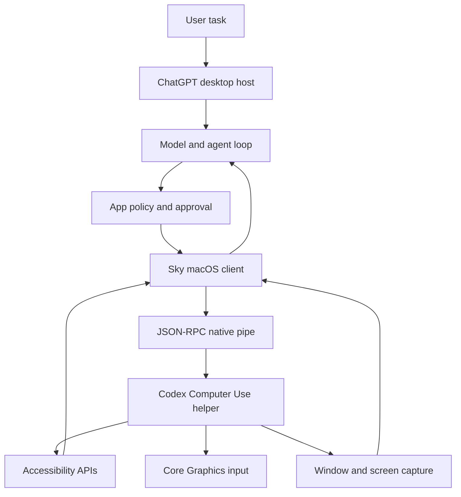
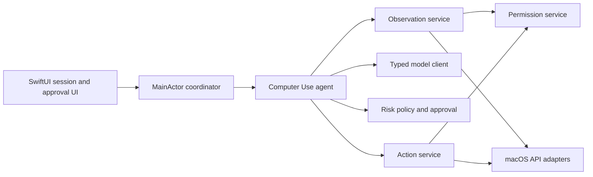

# KIS-169 Computer Use architecture notes

Status: research complete. The evidence ledger is the source of truth for claim status.

## Executive summary

The DMG contains three useful layers.

1. A ChatGPT desktop host owns the user interface and host services.
2. The Sky package exposes model-facing computer actions.
3. A native Computer Use helper performs macOS desktop work.

The public macOS Sky target is app based. It returns accessibility text and a screenshot. It then accepts one action at a time.

The observed design is not a single model call. It is a state and action loop.

The client-side model choice, request schema, context ordering, and local agent-loop implementation
are recoverable. Provider-private inference and hidden service-side processing remain unknown.

## Observed component map

Status: `[Inferred]` for the end-to-end flow. The component names and protocols are `[Verified]` in the ledger.

## Model, state, and action loop

### Model boundary

- `[Verified]` The Sky README calls the API model-facing.
- `[Verified]` Sky accepts a structured app target and returns structured state or action results.
- `[Verified]` The DMG contains model-profile base instructions and the complete readable Computer
  Use operating instructions. GPT-5.6 Sol, Terra, and Luna share identical base instructions in
  this artifact.
- `[Verified]` The app-server turn protocol accepts a client model override, and the request builder
  sends the resolved model slug. An isolated request serialized by the DMG binary selected
  `gpt-5.6-luna`.
- `[Verified]` The Responses request schema and ordering are recovered from the exact tagged client
  source and verified by a loopback capture from the shipped executable. See
  `runtime-request-and-model-selection-recovery-2026-08-08.md`.
- `[Verified]` A response can exceptionally report a different server model; the client emits a
  model-reroute event when it differs from the requested slug.
- `[Unknown]` Provider-private inference, hidden classifiers, exceptional reroute decisions, and
  post-receipt transformations are not established by the client artifact.

The model should not call macOS APIs directly.

The model should see a bounded observation.

The host should validate every model action before execution.

### State

The public macOS state contains:

- the targeted app identifier;
- a screenshot data URL or null;
- accessibility text from the target window.

The text can contain app-specific guidance on first access.

Element indices belong to the latest state.

The model must not reuse an old index after the UI changes.

### Loop

The observed and inferred loop is:

1. Resolve the target app.
2. Check the app policy.
3. Ask for user approval when the policy requires it.
4. Capture accessibility text and a screenshot.
5. Send the observation and task to the model.
6. Validate one model action.
7. Check approval and safety rules for that action.
8. Execute the action through Sky and the native helper.
9. Capture fresh state.
10. Repeat until the model finishes, the user stops, or the system fails.

Steps 1, 2, 4, 6, 8, and the returned data shape are `[Verified]` or directly represented by the artifact.

The static GPT-5.6 base instructions and Computer Use operating instructions are `[Verified]` from
the DMG. The client loop, request construction, role ordering, and model slug are also `[Verified]`.
The actual model response and provider-private inference for a particular production turn remain
`[Unknown]` until that turn is executed or captured.

## App and window discovery

### Public app discovery

`list_apps()` returns:

- a canonical app identifier;
- a display name when available;
- whether the app appears to run;
- a last-used timestamp when available;
- a usage count when available.

`get_app_state()` accepts an app identifier.

The public macOS API does not expose a separate stable window object.

The Windows window API does expose an explicit window object. This is a real platform difference.

The live native schema accepts an app name, full app path, or unambiguous bundle identifier.
Preserved helper symbols verify name/path/bundle lookup, a path that prefers an already-running
target, launch by name or URL, launch waiting, and explicit ambiguity errors when duplicate bundle
identifiers exist.

### Native discovery

`ComputerUseAppController.orderedWindows()` calls `CGWindowListCreate(0x11, 0)`, which requests
on-screen windows while excluding desktop elements. The helper converts those IDs to window
objects and cross-references them with AX window candidates. It also contains AX-to-CG matching in
both directions, primary-window waiting, and focused-context construction for an explicit window.

- `[Verified]` Native window discovery joins on-screen, non-desktop CG windows with AX windows.
- `[Verified]` The model-facing macOS API remains app-scoped; native window resolution is internal.
- `[Unknown]` The final ranking comparator when several matched windows remain for one app has not
  been reconstructed reliably.

## Accessibility and screenshot handling

### Accessibility

The live Calculator state returned a depth-indented preorder AX rendering with sequential integer
element IDs. Lines can include role and name, description, help, stable application-provided ID,
disabled state, and secondary actions. Preserved symbols verify the pipeline:

1. `ApplicationUIElement.flatTree(...)`
2. `UIElementTree.render(...)`
3. `UIElementRenderTree.setElementIDs()`
4. depth-first traversal and line rendering

The helper retains tree revisions, maps integer IDs back to AX elements, compares old and new
render trees, inherits IDs for matched nodes, and emits depth-first insertion/removal-aware
changes. A second unchanged live state returned the full rendering and screenshot, so not every
subsequent observation is exposed as an empty diff.

- `[Verified]` The observable flattening shape, element-ID assignment, retained revision model,
  and diff architecture are recoverable.
- `[Unknown]` Exact node-matching equality keys, line-budget constants, and every full-tree
  fallback condition remain unrecovered.

### Screenshots

The public state returns screenshot image content. The live native MCP response used JPEG.

The capture bridge also returns a local screenshot URL and MIME type.

The worker validates image paths and allows PNG, JPEG, and JPG output.

The worker rejects images larger than 25 MB.

The helper exposes window-ID-scoped capture with crop, size, opacity, shadow, delay, and encoding
options. It contains both `SCScreenshotManager` capture and a SkyLight/WindowServer capture path.

- `[Verified]` Both capture backends and their common window-scoped abstraction are present.
- `[Unknown]` The exact runtime matrix choosing ScreenCaptureKit versus SkyLight for every OS and
  window condition remains unrecovered.

## Supported macOS actions

| Action | Public input | Evidence status |
| --- | --- | --- |
| `click` | Element index or app-window coordinates, button, click count | `[Verified]` |
| `drag` | Start and end app-window coordinates | `[Verified]` |
| `press_key` | One key or a `+` key chord | `[Verified]` |
| `scroll` | Direction, pages, and element index | `[Verified]` |
| `type_text` | Text and app target | `[Verified]` |
| `set_value` | Element index and replacement value | `[Verified]` |
| `select_text` | Element index, text, context, and selection mode | `[Verified]` |
| `perform_secondary_action` | Element index and accessibility action name | `[Verified]` |

The action wrappers pass requests through the same app policy gate.

The helper resolves indexed AX elements against the current retained revision. Semantic paths use
AX press/actions, settable values, text ranges, and scrollbars. Fallback paths synthesize click,
drag, scroll, key, and Unicode text events and post them to the target PID. Its recovered
screenshot-to-screen transform is:

`screenPoint = (screenshotPoint * scalingFactor) + optionalWindowOrigin`

It also has conditional synthetic-focus coordination. The target does not have to become
frontmost for observation; an individual input path can coordinate focus when necessary.

- `[Verified]` Semantic AX and process-scoped synthesized-event mechanisms are both present.
- `[Unknown]` Every role- and app-specific branch choosing semantic AX behavior versus synthesized
  input remains unrecovered.

## Permissions

The helper reports a permission grant state.

The observed states include:

- no permission granted;
- Accessibility granted;
- Screen Recording granted;
- both permissions granted.

The helper also reports pending and abandoned permission flows.

The helper binary contains named Accessibility and Screen Recording permission types.

The helper links ApplicationServices, CoreGraphics, ScreenCaptureKit, and AppKit.

The exact TCC calls and prompt sequence remain `[Unknown]`.

## Approval and safety

The Sky policy has two layers.

First, the app policy can allow, deny, or forbid use.

Second, the host can ask the user for approval.

The approval request names the app.

The approval metadata identifies the Computer Use connector and the app bundle identifier.

The visible persistence choices include session and always.

The observed approval bridge supports accept, decline, and cancel.

The bridge times out after five minutes.

It rejects pending requests when its transport closes.

The artifact also contains settings for allowed apps, click sounds, and use while the Mac is locked.

The artifact contains app-specific safety instructions.

For example, the Slack instructions warn that Return can send a message. The Clock instructions require a current timer state before starting a new timer.

These examples show that safety needs context. A blanket click permission is not enough.

The full production safety policy is `[Unknown]` from this DMG alone.

## Native helper responsibilities

### Verified responsibilities

The helper is a signed arm64 app.

It has a dedicated bundle identifier and application group.

It links the main macOS frameworks needed for Accessibility, input, capture, windows, and XPC.

Its binary contains JSON-RPC socket, XPC, permission, window, AX, CGEvent, and ScreenCaptureKit names.

### Recovered responsibilities

Live calls, preserved Swift symbols, imported APIs, and targeted disassembly verify that the
helper:

- resolves and launches app targets and reports ambiguity;
- joins CG and AX windows and builds focused contexts;
- reads, flattens, renders, revisions, and diffs AX trees;
- maps observation-scoped integer IDs back to current AX elements;
- captures one or more window IDs through ScreenCaptureKit or SkyLight paths;
- converts screenshot coordinates to screen coordinates;
- performs semantic AX actions and process-scoped synthesized input;
- waits for UI settling and refetches invalidated AX state;
- monitors physical input, focus changes, lock state, and native permission/error conditions.

See `native-algorithm-recovery-2026-08-09.md` for the evidence boundary and the five remaining
native questions.

## Process communication

### Sky to native helper

The macOS Sky client uses a Unix socket in the helper application group.

The client sends JSON-RPC messages.

The transport uses a four-byte little-endian frame length.

The client pings the server and checks the API version.

The client starts the helper through a host launch-services bridge when the socket is unavailable.

### ChatGPT worker to native helper

The readable worker uses Apple Events for appshot capture.

It resolves the helper process identifier.

It sends JSON request data in an Apple Event.

It receives typed capture updates.

The worker retries selected Apple Event transport failures.

### Boundaries that remain unknown

The desktop host's exact production process ownership across every turn is not fully established.
The app-server request composition and model-facing Computer Use prompt are recovered, while the
final host-to-native route can differ between the node-REPL and legacy-MCP feature variants.
No explicit native cancellation point has been verified for every action after an event is already
being posted.

## Error, cancellation, and user intervention

### Verified error paths

The error table includes permission, app lookup, policy, active-session, stopped-session, pending-permission, user-intervened, ambiguous-app, and screen-locked errors.

Capture can fail before start, during an update, or after completion.

The worker handles a completed response without a screenshot.

The worker handles abandoned permission setup.

The approval bridge handles user decline, cancel, timeout, and transport closure.

### Inferred session behavior

The loop should stop on any terminal error.

The loop should not repeat a failed action without fresh state.

The loop should re-observe after user intervention.

The loop should treat physical user input or invalidated target state as intervention/recovery
signals. The helper contains process-scoped and system event taps, physical-input monitoring,
focus-steal prevention, AX invalidation monitoring, and screen-lock guards.

- `[Verified]` Dedicated native monitoring paths exist for these conditions.
- `[Unknown]` The exact intervention debounce interval and cancellation behavior during an event
  already being sent remain unrecovered.

## Desktop control versus browser control

The macOS window target is a general app-control API.

It uses app identifiers, accessibility text, screenshots, and native actions.

The DMG also contains a separate browser-use plugin and browser-use settings.

The browser settings refer to an in-app browser and browser extensions.

The settings link browser configuration to Computer Use settings.

The browser implementation can use browser-specific state such as tabs, URLs, DOM data, sessions, and extension permissions.

The exact browser protocol is not established by the macOS Sky files.

The safe design conclusion is `[Inferred]`: Suniye should keep desktop control and browser control as separate adapters. Desktop actions should not pretend to understand browser DOM state.

## Suniye: current capability and required additions

### Suniye already supports

The current Suniye source provides these capabilities:

- `[Verified]` Hold-to-talk audio capture.
- `[Verified]` Local speech recognition through the existing transcription services.
- `[Verified]` Optional text cleanup through Magic Format.
- `[Verified]` Focused text insertion through Accessibility.
- `[Verified]` Clipboard-preserving paste fallback.
- `[Verified]` Return-key submission through Core Graphics events.
- `[Verified]` Edit Mode for selected text.
- `[Verified]` Per-application text prompt bindings.
- `[Verified]` Protocol injection and test doubles for many services.
- `[Verified]` Microphone and Accessibility permission onboarding.

These capabilities are useful building blocks. They do not form a Computer Use loop.

### Suniye gaps at initial inspection

The new capability needs these additions:

- `[Verified]` App catalog and target resolution are absent.
- `[Verified]` Key-window discovery and stable target identity are absent.
- `[Verified]` General Accessibility tree reading and serialization are absent.
- `[Verified]` Window or display screenshot capture is absent.
- `[Verified]` Mouse, keyboard, scroll, drag, and semantic AX actions are absent.
- `[Verified]` A multimodal model request and typed action response are absent.
- `[Verified]` A state machine for observe, decide, approve, act, and re-observe is absent.
- `[Verified]` Action risk classification and hard safety blocks are absent.
- `[Verified]` One-time and session approval flow is absent.
- `[Verified]` User stop, cancellation, target-change detection, and intervention handling are absent.
- `[Verified]` Action audit records and useful error categories are absent.
- `[Verified]` Screen Recording permission handling is absent.
- `[Verified]` A separate browser adapter is absent.

The existing `TextInsertionService` can inform the text-entry design. It cannot serve as the complete action service.

### Current staged implementation

The bullets in this historical section describe the incremental implementation before the
superseding correction below. The correction section is authoritative for the current branch.

- `[Verified]` Phases 0 and 1 add app discovery, target windows, bounded AX serialization, screenshot capture, permissions, preview, and cancellation.
- `[Verified]` Phase 2 adds bounded click, key, scroll, text, and semantic AX actions with fresh-observation validation.
- `[Verified]` Phase 3 adds the actor-isolated observe-decide-approve-act loop and intervention checks.
- `[Verified]` Phase 4 adds denied/forbidden policy outcomes, scoped approvals, revocation, and redacted audit records.
- `[Verified]` Phase 5 adds a separate typed remote model client, coordinator integration, explicit API settings mapping, and screenshot-upload consent.
- `[Verified]` The current parity slice adds bounded click metadata, indexed clicks, positioned
  scroll, drag, AX value setting, text selection, dynamic AX actions, screenshot IDs, selected-window
  targeting, explicit window activation, and always-allowed approval management.
- `[Verified]` The current frontmost check uses live frontmost-process state. A stale application discovery record does not grant control to a background app.
- `[Deferred]` Browser-specific control remains a separate adapter. The current desktop path does not infer browser DOM or tab state from screenshots.
- `[Deferred]` A separate native helper is not part of the current same-process Swift design. The inspected helper's source and exact runtime contract remain unavailable.

## Independent Swift architecture for Suniye

This section is a design proposal. It is not a claim about the DMG implementation.

The proposed ownership is:

- `[Proposed]` `ComputerUseCoordinator` owns UI state and user commands.
- `[Proposed]` `ComputerUseAgent` owns one session loop and does not touch SwiftUI.
- `[Proposed]` Observation and action services hide AppKit, ApplicationServices, CoreGraphics, and ScreenCaptureKit.
- `[Proposed]` The model client uses a separate protocol from Magic Format.
- `[Proposed]` Policy runs before every action, even after a previous approval.
- `[Proposed]` The session uses a target identity that includes the app, process, window, and observation generation.

The main-window Computer Use page starts and stops the coordinator. `AppState` supplies the
existing API settings and keychain-derived model configuration. It does not own the loop's
internal details.

## Corrective parity update: 2026-08-03

- `[Verified]` The mounted `sky-window2-api.md` reference documents explicit window records,
  window-relative coordinates, `set_value`, `drag`, `perform_secondary_action`, and
  `activate_window`.
- `[Verified]` Suniye now exposes the selected window in the session UI and provides an explicit
  Bring Forward path. Agent startup activates the selected window once, then the intervention
  monitor still stops the run if the user changes the frontmost app or window.
- `[Verified]` Suniye supports the reference's common coordinate and value actions, plus the older
  API's text-selection behavior, through typed Swift models and native adapters.
- `[Partial]` Reference-level transient screenshot caching and state diffs are not yet part of the
  Suniye contract. Indexed click and dynamic secondary AX action names are now represented.
- `[Verified]` The live `@Computer` path activates a selected Suniye window, captures an
  Accessibility-only observation, presents an approval card, and returns safely after denial.
- `[Unknown]` Real multi-display coordinates, Screen Recording capture, cross-process activation,
  native input delivery, and the reference's exact state-revision implementation require further
  live macOS tests.

## Evidence limits

- `[Verified]` Static bundle inspection exposes public wrappers, strings, resources, and transport code.
- `[Verified]` The DMG contains the complete readable static Computer Use operating instructions
  and GPT-5.6 base instructions. The client request schema and ordering are recovered and were
  confirmed with a loopback request serialized by the DMG binary.
- `[Verified]` The helper's source code is not shipped, but live MCP calls, preserved Swift
  symbols, imported APIs, and targeted disassembly recover the observable protocol and major native
  algorithms.
- `[Unknown]` Provider-private inference and the five narrow native details enumerated in
  `native-algorithm-recovery-2026-08-09.md` remain unavailable.
- `[Unknown]` Exact browser behavior needs a browser trace or browser documentation.

## Research limitation

The reference target could not be used as a target for Computer Use in this inspection. Prior local
evidence reports that the reference refuses its own app for safety. Suniye's separate live E2E used
Suniye itself as a deterministic safe target and is recorded in `e2e-computer.md`.

Static bundle and helper evidence support the architecture above.

## Superseding implementation correction — 2026-08-03

- `[Verified]` The Mac client surface is app-scoped. Suniye's concrete window record is now an
  internal adapter detail used to resolve AX, capture the app window, activate it, and translate
  coordinates; it is not exposed as a user-selected session target.
- `[Verified]` The agent runs without local action, failure, or duration counters. It re-observes
  after each successful action and ends on a model terminal decision, a platform/provider error,
  cancellation, or provider timeout.
- `[Verified]` The action service does not inspect the cached observation to approve an element
  index or Accessibility action name. It forwards those identifiers to the native Accessibility
  adapter, matching the inspected Mac client boundary.
- `[Verified]` Screenshots are captured on every macOS observation and are part of the model
  request. The model prompt contains Accessibility text, not a duplicate structured element dump.
- `[Unknown]` The native helper's full process boundary, IPC authentication, model loop, and
  browser adapter remain outside static evidence.
